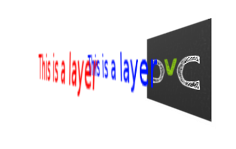
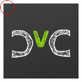
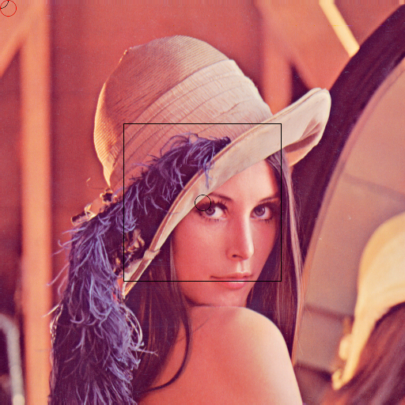
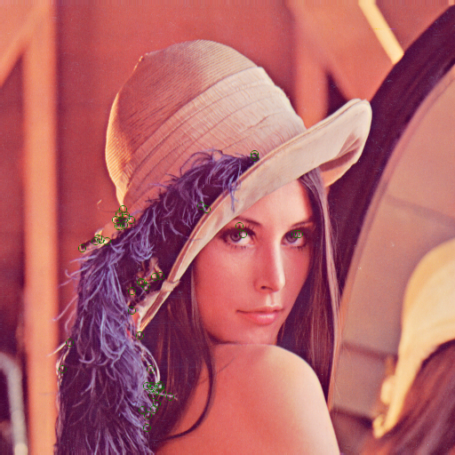

Drawing on Images in SimpleCV
=================================
Most of the time when using a vision system it is nice to have some
form of visual feedback to the user of the vision system that something
has occured when programmed to detect an object.  Throughout most of
programming the vision system we have used the command line to output
useful information.

For instance, say we were doing face detection, using the command line
we could print out the location of the face in it's X,Y coordinates, but
really that is not very useful visually because in our minds converting
that number to an actual location on the screen. It's much more useful to
say draw a box around the found face.

Fornately SimpleCV has very easy methods for being able to draw, or mark
up the images to notify that something is going on.  Before we get into
how to use some of the functionality we'll talk a little bit about how
things are structured.

In simplecv there is a single "display" object.  In turn these means you
can only have a single window open viewing the camera at any single time.
Even though SimpleCV supports multiple cameras, you can only view one at
at time using the standard method, although there are more advanced ways
to do it as well through a web browser, they will not be discussed here.

To show off a simple example, we will talk a little bit about layers.
Very similiar to the concept of layers on an onion.  In our case our layers
can be unlimited and what's ever above or on top of the other layer will
cover the layer below it.  Let's look at the simplecv logo with some text
written on it.

.. figure:: ../images/display-layers-logo.png

Which in reality is an image with 3 layers, each layer has the text
displayed.  If we rotate the image and expand the layers you can get a
better idea of what is really happening with image layers.

Layers
----------------------
Now that you have an understanding of what layers are, we can now start
to use them within SimpleCV.  To get a better understanding of that we
need to take a look at the DrawingLayer class built into SimpleCV. This
class is where all the actual drawing takes place.  This is not to be
confused with the Display class as that is used for the actual rendering
of the layers.  The DrawingLayer class is used to store all the various
information about things like features that are found, or text being drawn.

To explain the DrawingLayer class more precisely,
DrawingLayer gives you a way to mark up Image classes without changing
the image data itself. This class wraps pygame's Surface class and
provides basic drawing and text rendering functions

 
Example::

	>>> scv = Image('simplecv')
	>>> logo = Image('logo')
	>>> scv.dl().blit(logo) #write image 2 on top of image

You should get an image similiar to:

.. figure:: ../images/display-blit.png

NOTE: Run **help DrawingLayer** for more information.

What just happened in the previous example was we added a layer, put
the logo on that new layer, then added that layer to the exist image.
In fact, that's what the **blit()** function did in one step, but instead
lets walk through that example.::

	>>> scv = Image('simplecv')
	>>> size = scv.size()
	>>> print size
	(118, 118)
	>>> print scv._mLayers #this is where all the layers are stored
	[<SimpleCV.DrawingLayer.DrawingLayer instance at 0x29afdd0>]
	>>> layer1 = DrawingLayer(size)
	>>> scv.addDrawingLayer(layer1)
	>>> print scv._mLayers
	[<SimpleCV.DrawingLayer.DrawingLayer instance at 0x29afdd0>,
	<SimpleCV.DrawingLayer.DrawingLayer instance at 0x29b3b90>]

As you can see we now have two layers, and we can continue to add as many
as we would like.  In this example the layer isn't really doing anything.
But let's continue to extend it to make it actually do something.

	>>> logo = Image('logo')
	>>> dl = logo.dl()

In this example we are loading up the logo and then loading up it's
drawing layer.  Please note that the dl() function is just a shortcut
to the getDrawingLayer() function.

	>>> dl = logo.dl()
	>>> dl = logo.getDrawingLayer() #same as above

You can also specify what layer number you are trying to access, so in
the previous example we can see there are two layers::

	>>> print len(scv._mLayers)
	2
	>>> dl = scv.dl(0)
	>>> print dl
	<SimpleCV.DrawingLayer.DrawingLayer instance at 0x29afdd0>
	>>> dl = scv.dl(1)
	>>> print dl
	<SimpleCV.DrawingLayer.DrawingLayer instance at 0x29b3b90>

Now these drawing layers can be used between images.  Let's take a layer
from one image and apply it to another image.

	>>> scv = Image('scv')
	>>> logo = Image('logo')
	>>> sdl = scv.dl()
	>>> ldl = logo.dl()
	>>> scv.addDrawingLayer(ldl)
	>>> scv.show()

Now you should see something like:

.. figure:: ../images/simplecv-logo.png

But wait, that isn't correct.  We just added the logo layer, so it should
be overlayed on top of the simplecv logo.  Well this is because nothing
is drawn on that actual layer.  The layers are used to actually mark up
the image.  For example, you want to draw a box around a face that was
detected in the image.

	>>> lenna = Image('lenna')
	>>> facelayer = DrawingLayer((lenna.width, lenna.height))
	>>> facebox_dim = (200,200)
	>>> center_point = (lenna.width / 2, lenna.height / 2)
	>>> facebox = facelayer.centeredRectangle(center_point, facebox_dim)
	>>> lenna.addDrawingLayer(facelayer)
	>>> lenna.applyLayers()
	>>> lenna.show()
	

Now you should get an image similiar to:

Using this we are able to draw many various types of objects, for instance
a circle.

	>>> circlelayer = DrawingLayer((lenna.width, lenna.height))
	>>> circlelayer.circle(center_point, 10)
	>>> lenna.addDrawingLayer(circlelayer)
	>>> lenna.applyLayers()
	>>> lenna.show()

And now you should get something like:

.. figure:: ../images/display-lenna-boxcircle.png

Now we can use that layer from the lenna image on another image. So if
we use

	>>> scv = Image('simplecv')
	>>> scv.addDrawingLayer(circlelayer)
	>>> scv.applyLayers()
	>>> scv.show()

You will notice you just get the simplecv logo, and that the circle is
not in the center.  Well this was because we specified the dimensions of
the circle layer to be the same as the lenna image, not the simplecv logo.
To demostrate let's make a new circle, this time red on the simplecv logo.

	>>> redcircle = DrawingLayer((scv.width, scv.height))
	>>> redcircle.circle((10,10), 10, color=Color.RED) #add circle point 10,10, radius 10.
	>>> scv.addDrawingLayer(redcircle)
	>>> scv.applyLayers()
	>>> scv.show()

Now you should see something like:

Now we can take that same layer and add it to the lenna image.

	>>> lenna.addDrawingLayer(redcircle)
	>>> lenna.applyLayers()
	>>> lenna.show()

Should now give an image simliar to:

Now, let's say that we just want our original image.  It's as simple as
running

	>>> lenna.clearLayers()
	>>> lenna.show()

And you should now have the original lenna image back.

Marking up the Image
-------------------------
There are various ways to notify a user when something occurs on the image.
Built into SimpleCV are a small number of ways to notify a user when say
a particular feature is found.  A good example would be to draw a box around
a face in a picture when face detection is being ran to know that the program
had actually found a face.  Or maybe you want to just show those interesting
features in a image.  For example we will show the corners found in the
standard lenna image.

	>>> img = Image('lenna')
	>>> corners = img.findCorners()
	>>> corners.draw()
	>>> img.show()

You should get something that looks like:

Notice the green circles.  They are to show use where the corner algorithm
had found everything.   SimpleCV also allows you to put these various type
of draw objects such as, rectangle, circle, etc. on screen to notify
the user something has occured.  The draw method used in the last example
is just a very quick and automatic way to display these found features.

In the last example, we learned how to get the drawing layer so we can
mark it up. In that example we just displayed a circle on the screen.
It's as easy as:

	>>> img = Image('simplecv')
	>>> img.dl().circle((10,10), 10, Color.RED)
	>>> img.show()

And you should have something similiar to:

.. figure:: ../images/display-simplecv-circle-corner.png

Drawing a rectangle is almost identical:

	>>> img = Image('simplecv')
	>>> img.dl().rectangle((10,10), (10,10), Color.RED)
	>>> img.show()

It is also possible to draw curve's, or more commonly refered to as
bezier curves.  These are basically just a set of points that can make
up a line.  We will randomly generate a list of points then plot them.

	>>> img = Image('simplecv')
	>>> points = []
	>>> for p in points: points.append((p, p ** 2))
	>>> img.dl().bezier(points, 3, Color.RED)
	>>> img.show()

and you should get something similiar to:

The list was randomly generated, but any set of points could have been
used.  Now we could use this to draw shapes, although, there is a better
function built in to peform this type of task.  We typically refer to
shapes as circle's, square, triangle, etc.  But more generally these
are refered to as a polygon.  To draw them in SimpleCV we just call
the polygon function on the drawing layer.

	>>> img = Image('simplecv')
	>>> points = [(10,10),(30,20),(50,10),(40,50),(10,40)]
	>>> img.dl().polygon(points, filled=True, color=Color.RED)
	>>> img.show()

You should get an image similiar to:

Notice how we specified the filled option.  You could manually define
points to say make a certain shape pop up when something either passes
or fails.

Text and Fonts
------------------------------------------
Displaying text on the screen is extremely easy in SimpleCV.  Typically
text is much more useful to display than say an object on the screen.
Although there are instances were the latter is more useful.  For example
in the previous corner detection example, we want to know where the corners
are located, it is much easier to draw them at their actual cordinates than
say printing their coordinates to the screen.  Now text maybe more useful
in a case where the status may not be so binary in nature. In a manner
of speaking, a corner is either found or not, but maybe we want to know
how many corners were found overall.  This is where displaying text comes
in way more useful.  In fact let's code that up.

	>>> img = Image('lenna')
	>>> corners = img.findCorners()
	>>> num_corners = len(corners)
	>>> txt = "Corners Found:" + str(num_corners)
	>>> img.drawText(txt)
	>>> img.show()

and you should get an image similiar to:

.. figure:: ../images/display-lenna-text-corners.png

Another thing you are able to do with SimpleCV is set the font's to
be some other type of font.  To see what fonts are available you just
use the command::

	>>> img = Image('simplecv')
	>>> img.dl().listFonts()
	[u'liberationserif',
	 u'dejavuserif',
	...
	 u'purisa',
	 u'ubuntu']

The above example has been shorted but you can see there is a big list.
You may notice the u'FONT'.  This is just specifying the string is encoded
in unicode.  We can then use this list of fonts to pick one to use to display
text.  For convience we'll just use one of the last ones on the list,'purisa'.
Notice the u' wasn't included.  This is due to the fact that the
unicode part of the string isn't required, although can be included if wanted.

	>>> img = Image('lenna')
	>>> img.dl().selectFont('purisa')
	>>> img.drawText("Hello!")
	>>> img.show()

This should give something like:

.. figure:: ../images/display-lenna-font-purisa.png

