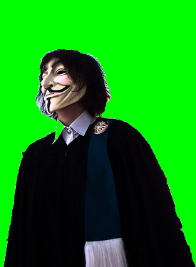

Image Arithmetic
=========================
As we discussed before, images are basically just matrices of pixel values
that range from 0 to 255.  And since they are built in this format, it is
actually easy to perform arithmetic (math) on images, such as addition or
subtraction.

There are many uses for performing image math.  For the first example
we will show what happens when we add two images together.

	>>> imgA = Image("simplecv")
	>>> added = imgA + imgA
	>>> added.show()

So what we did was take the original simplecv image logo that looked like

.. figure:: ../images/simplecv-logo.png
   :scale: 100 %
   :align: center

and converted so it looked like this:

If you note that since ( X + X = X * 2) we can also try this as well.

	>>> imgA = Image("simplecv")
	>>> mult = imgA * 2
	>>> mult.show()

You should get the same exact image as shown before.
You can also perform subtraction.  Except what is different here, is that
using subtraction will only show what has changed between the two images.

	>>> logo = Image("logo")
	>>> sub = logo - logo
	>>> sub.show()

You should get a completely black image.

..note: To perform image math the images have to be the same exact size

It is also possible to perform division on images.  This is useful for
lowering the contrast.  For instance if you use the SimpleCV logo:

.. figure:: ../images/simplecv-logo.png
   :scale: 100 %
   :align: center

And if we divide the image by 10:

	>>> scv = Image("simplecv")
	>>> div = scv / 10
	>>> div.show()

and you should get something that looks like:

.. figure:: ../images/image-math-div.png
   :scale: 100 %
   :align: center

Now you maybe asking when image math is actually useful.  Well let's give
a quick example.  We will show how simple subtraction can be used to
detect motion.  In this example we have a picture of a person, then the
next picture you can tell they waved their hand.  Then we will subtract
those two images and you will only what has changed between the two
images.

.. figure:: ../images/image-math-person1.png
	:scale: 100 %
	:align: center

	Previous Frame

.. figure:: ../images/image-math-person2.png
	:scale: 100 %
	:align: center

	Current Frame

.. figure:: ../images/image-math-person-sub.png
 :scale: 100 %
 :align: center

 Difference Image

As seen above only the pixels that changed between the two images are
shown.  To perform a similiar example just do:

	>>> cam = Camera()
	>>> prev = cam.getImage()
	>>> current = cam.getImage()
	>>> diff = current - prev
	>>> diff.show()

But how does that tell us that motion occured?  Well we can use some
basic math to figure that out.  We know if the pixel value was black (0)
then nothing had changed, but if not black, then something must have
changed.  We will compute how much of the entire picture actually changed.

To do this we will just get the image matrix and add a counter::

	>>> area = diff.width * diff.height
	307200 #this is our image area in pixels
	>>> matrix = diff.getNumpy()
	>>> matrix.shape
	(640, 480, 3)
	>>> flat = matrix.flatten()
	>>> counter = 0
	>>> for i in flat:
		if flat[i] == 0: #if black
			counter += 1

	>>> percent_change = float(counter) / float(len(flat))
	>>> print percent_change
	0.818358289930555

With this you are able to determine about 0.8 or 80% change in pixels.
Although this is not the most efficient way we can now use this change
as a threshold value.  For instance send an e-mail if 90% of the pixels
change, and using a threshold you can minimize the chance of false positives
happening.

As mentioned this probably isn't the most effecient way to determine if
motion has occured, but it is probably the most basic method and was just
meant to show how you can use image math to do some basic useful things.

We can also use other properties of the image. For instance any standard
type of mathematic statistics functions are available.  This could be mean,
standard deviation, etc.  As in the previous example we could instead use
the mean which is much quicker.

Let's use that in a complete program below::

	from SimpleCV import *

	cam = Camera()
	threshold = 5.0 # if mean exceeds this amount do something

	while True:
		previous = cam.getImage() #grab a frame
		time.sleep(0.5) #wait for half a second
		current = cam.getImage() #grab another frame
		diff = current - previous
		matrix = diff.getNumpy()
		mean = matrix.mean()

		diff.show()

		if mean >= threshold:
			print "Motion Detected"

	

:download:`Download the code <../code/motion-detection.py>`

	
Exceptions in Image Math
--------------------------------
In image math you will never have a negative number.  This is because
values will push the value.  The values can be between 0 and 255, no more
no less.

Examples::

	200 - 255 = 0
	100 + 200 = 255
	0 + 300 = 255
	

If we remember, that color or greyscale still uses the 0 to 255 value.
And keep in mind that white is all colors, and black is the absence of
color. So if you were to add say a completely blue image to a white image
the image would still be white, because::

	white = (255,255,255)
	blue = (0, 0, 255)
	white + blue = (255, 255, 255)

And in fact you can verify this with the following code::

	>>> black_img = Image((20, 20)) #make a 20 x 20 pixel black image
	>>> black_img.show()
	>>> blue_img = Image(black_img.getNumpy() + Color.BLUE)
	>>> blue_img.show()
	>>> white_img = black_img.invert()
	>>> white_img.show()
	>>> added_img = white_img + blue_img
	>>> added_img.show()

Histograms
==========================

Another extremely useful tool when performing math on images is to use
a histogram.  A histogram is what is typically used in statistics, and
is basically just a plot of the values in a list.  These values can
be anything really, from a list of the area of features found, to coordinates,
etc.  But what typically histograms are used for is a list of all the colors
from each of the color channels in an image.

Earlier we talked about colors ranging from 0 to 255. And this is per channel
on a grey image the same color is used across all channels.  For instance
let's take a look at the histogram of the simplecv logo in grey.::

	>>> img = Image('simplecv')
	>>> gray = img.toGray()
	>>> histogram = gray.histogram()
	>>> len(histogram)
	50
	>>> print histogram
	[1929,
	 2562,
	 ...
	 0,
	 2372]

	
This was a list of values as a frequency of their occurance in the image.
In this case there are 50 values in this list.  These are referred to as
**bins**.  You can change the number of bins by passing it as a value. For
instance if we want to show all 255 values then just use.::

	>>> histogram = gray.histogram(255)
	>>> len(histogram)
	255
	

Now we want to see what that actually looks like so we will plot it.

	>>> plot(histogram)

and you should see an image similiar to.

	.. figure:: ../images/simplecv-histogram.png

	Histogram of SimpleCV logo in Gray

If you look at the above image you will see basically the distribution
of the colors plotted.  Since the image is gray, then you will notice a
high frequency of occurances near the black (0) and white (255) end of
the histogram, with not much in the middle.  To verify this, let's do
the same plot with the color image to see the differences.  But we also
have to plot each color channel seperate, so Red, Green, and Blue all
range from 0 to 255.

	>>> img = Image('simplecv')
	>>> (red, green, blue) = img.splitChannels(False)
	>>> red_histogram = red.histogram(255)
	>>> green_histogram = green.histogram(255)
	>>> blue_histogram = blue.histogram(255)

	.. figure:: ../images/simplecv-histogram-red.png

	Histogram of SimpleCV logo Red Color Channel

	.. figure:: ../images/simplecv-histogram-green.png

	Histogram of SimpleCV logo Green Color Channel
	

	.. figure:: ../images/simplecv-histogram-blue.png

	Histogram of SimpleCV logo Blue Color Channel

Color Space
====================
Something that hasn't been talked about too much is the idea of color space.
Basically this is the method used to describe color.  The most commonly used
and well known color space is Red-Green-Blue (RGB).  It's similiar to something
you may have seen in art class called the color wheel.

	.. figure:: ../images/color-wheel.png

	Image of Color Wheel

What color space is basically the way you figure out the color.  For instance
in RGB color space to get the color blue, it's just (0,0,255) for the RGB values.
There are many other ways to describe color.  Another popular method is
called Hue-Saturation-Value (HSV).  This is another method to represent blue for
instance, and it's value in HSV is (240,100,100).  Lets look at an example.::

	>>> img = Image('simplecv')
	>>> hsv = img.toHSV()
	>>> histogram = hsv.histogram(255)
	>>> print histogram
	[34, 209, 408, 602, 676, 0, 688, 680, 603, 591, 485, 0, 546, 603, 677,
	743, 0, 815, 689, 536, 317, 187, 0, 101, 56, 26, 12, 0, 10, 8, 5, 5, 4,
	0, 0, 0, 2, 0, 0, 3, 4, 9, 10, 12, 0, 5, 4, 0, 0, 0, 0, 1, 3, 2, 0, 0,
	7, 12, 10, 6, 0, 10, 10, 5, 2, 1, 0, 0, 1, 0, 0, 3, 0, 8, 13, 18, 16, 0,
	4, 5, 1, 0, 2, 0, 9, 3, 3, 2, 0, 2, 21, 13, 15, 21, 0, 28, 3, 6, 2, 0,
	0, 0, 0, 7, 6, 0, 11, 17, 15, 14, 0, 6, 2, 5, 27, 11, 0, 0, 0, 0, 0, 0,
	18, 22, 38, 66, 15, 0, 1, 3, 1, 1, 0, 0, 18, 19, 1, 1, 0, 12, 26, 34, 14,
	14, 0, 42, 2, 0, 0, 0, 0, 0, 0, 0, 11, 0, 59, 33, 13, 8, 0, 1, 0, 0, 0, 4,
	0, 0, 0, 0, 0, 0, 4, 23, 21, 7, 0, 0, 0, 0, 0, 0, 0, 0, 0, 0, 0, 0, 0, 22,
	20, 6, 0, 0, 0, 0, 0, 0, 0, 0, 0, 0, 0, 0, 26, 0, 76, 22, 0, 0, 0, 0, 0, 0,
	0, 0, 0, 0, 0, 0, 0, 0, 33, 16, 1, 0, 0, 0, 0, 0, 0, 0, 0, 0, 0, 0, 0, 7,
	0, 37, 0, 0, 0, 0, 0, 0, 0, 0, 0, 0, 0, 0, 0, 1135, 1237]
	>>> plot(histogram)

As you can see the values are quite a bit different than the same image's
histogram using the RGB color space.

	.. figure:: ../images/simplecv-histogram-hsv.png

	Histogram of SimpleCV logo using HSV colorspace

Now many of these different color spaces are used for many various things.
In the case of HSV the first value, hue, can be adjusted to basically adjust
the color level, so for instance if you wanted to shift the blue to a light
blue then you can just adjust the hue channel. If you were using RGB color
space, trying to adjust the "lightness" of the blue would require you to
adjust 3 channel values.

For the most part you won't have to muddle around with other color spaces.
All the image algorithms can work the same in the color spaces, but color
spaces make it easier to optimize for particular tasks.  For instance maybe
we wanted to check how blue something was.  Using HSV we could easily use
the saturation value as a threshold, so if it was above 80 but below 100.  To
do this using RGB would be much more complex.

please visit the wikipedia article if you would like to know more about colorspace:
http://en.wikipedia.org/wiki/Color_space

Using Hue Peaks
-------------------------
The hue peaks function is used to help figure out what the dominant color
in an image is.  Using a histogram we can plot the values and see the actual
peaks.  What the huePeaks function does it make it convient to find this color.
In this example we will use the lenna image to find the color (or hue) peaks.::

	>>> lenna = Image('lenna')
	>>> histogram = lenna.hueHistogram()
	>>> print histogram
	[13682 14520 12393 11312 10730  9966  9128  8128  7309  5738  4115  2624
		1670  1252  1358  2110  2978  2430  1083   230    62    30    18    14
			 5     1     2     0     1     0     0     0     0     0     0     0
			 0     0     0     0     0     0     0     0     0     0     0     0
			 0     0     0     0     0     0     0     0     0     0     0     0
			 0     0     0     0     0     0     0     0     0     0     0     0
			 0     0     0     0     0     0     0     0     0     0     0     0
			 0     0     0     0     0     0     0     0     0     0     0     0
			 0     0     0     0     0     0     0     0     0     0     0     0
			 0     0     1     0     1     0     0     0     1     2     1     2
			 3     5     7     5     7    14    20    17    11    22    29    37
			45    67    66    72    95   127   133   157   189   223   263   310
		 336   459   471   489   571   648   595   761   994  1087  1318  1590
		1897  2357  3120  3674  4432  4480  4876  4798  4699  4292  3575  3055
		2653  2510  2857  3287  4051  4720  5857  7496  9962 12562 26794]
	>>> peaks = lenna.huePeaks()
	>>> print peaks
	[(162.0, 0.0186004638671875)]
	>>> plot(histogram)

Hue Histogram of Lenna Picture

	.. figure:: ../images/lenna-histogram-hue-peaks.png

As you can see, the huePeaks() function list the value of 162, and looking
at the plot you can see there is a peak there.  Where this type of function
maybe quite useful is trying to bring out the highest value color in the
picture.  To do this just use::

	>>> lenna = Image('lenna')
	>>> peaks = lenna.huePeaks()
	>>> print peaks
	[(162.0, 0.0186004638671875)]
	>>> peak_one = peaks[0][0]
	>>> print peak_one
	162.0
	>>> hue = lenna.hueDistance(peak_one)
	>>> hue.show()

	
Hue Distance of Lenna Image (blacker means closer to hue peak)

	.. figure:: ../images/lenna-hue-distance.png

Creating a Motion Blur Effect
-----------------------------
Here is a very good example of where you could use image math to add some
effects to a video.  Using some of the simple math functions built into
python we can quickly do this to a live stream.

Let's show the code::

	from operator import add
	from SimpleCV import *

	cam = Camera()

	frames_to_blur = 4
	frames = ImageSet()

	while True:
		frames.append(cam.getImage())

		if len(frames) > frames_to_blur:
			frames.pop(0)  #remove the earliest frame if we're at max

		pic = reduce(add, [i / float(len(frames)) for i in frames])
		#add the frames in the array, weighted by 1 / number of frames

		pic.show()

:download:`Download the script <../code/motion-blur.py>`

Let's discus what is happening here.  We load add from the operator library
so we can 'add' the images back together.  We set the frames_to_blur to 4, what
this does is set the number of frames to basically blur together.  We then
create a ImageSet, this is basically a list of images with some built in
options like mass saving the images in the list or viewing them. We then
run through an infinite loop and keep adding images, if the number of frames
added exceeds the number to blur then remove one from the list.

The reduce function is part of the standard python library.  You may want
to look some more into using map and reduce as functions in python as they
are very quick and powerful.  In this case we are using the add function
to reduce all the images (or add them together).  After they are summed into
a single image they are then shown.

Simulating Long Exposure
--------------------------------
Have you ever saw the type of art people can make using long exposure?
Typically the images look something similiar to:

	.. figure:: ../images/light-art.png

image taken from: http://www.flickr.com/photos/torres21/3688474968/

This is commonly refered to as light art.  In this example we are going
to simulate what is happening.  Basically it's just a sum of the images
compressed into a single image.::

	from SimpleCV import *

	image_directory = "../images/exposure/"
	frames = ImageSet() #create an empty image set
	frames.load(image_directory) #load the directory of images
	img = Image(frames[0].size()) #create an initial empty image
	num_of_frames = len(frames) #count the number of images

	for frame in frames:
		img = img + (frame / num_of_frames) # merge the images together

	img.show()
	time.sleep(1000)

:download:`Download the script <../code/long-exposure.py>`
	
In our example we take a set of images, load them into memory, then run
though that list and compress them. The images directory has about 10
images of a person walking by a wall.  We create an imageset to store
images in, this could be a list, but using the built in image set makes
it much easier for us to load.  We have to then create a empty image,
this is used as a base to average the rest of the images against.  We then
run through the list of frames.

When ran we should get something that looks like:

.. figure:: ../images/long-exposure.png

Chroma Key (Green Screen)
------------------------------
We all have seen the weather reporter on television.  They stand up in
front of a screen and point to where storms maybe moving in, which direction
the wind is moving, etc.  The method they are doing this with is typically
called a green screen.  It is also (or used to be) one of the main methods
to insert an actor into a movie or existing footage.

The way this is performed is basic image math, we are basically subtracting
the certain colors we don't want from that image.  In our example we put
our "anonymous" person in front of the green screen.

picture taken from: http://www.flickr.com/photos/pittaya/4785149065/

.. figure:: ../images/green-screen-wallst.png

picture taken from: http://www.flickr.com/photos/willemvanbergen/271204700/

We use these pictures to create a mask.  And no, pardon the pun, but not the mask
the person is wearing in the picture.  A mask has a similiar concept in image processing
and in theory is similiar, you would wear a mask to hide your face, well
a mask in image math is used to hide that part of the image.  Our masked
image should look something like:

.. figure:: ../images/green-screen-masked.png

To finally get something that looks like:

.. figure:: ../images/green-screen-result.png

The code to perform a green screen is::

	from SimpleCV import *

	sleep_time = 2 #the amount of time to show each image for

	#Load and show the greenscreen image
	print "Showing Greenscreen image"
	greenscreen = Image("../images/green-screen-person.png")
	greenscreen.show()
	time.sleep(sleep_time)

	#load and show the background image
	print "Showing background image"
	background = Image("../images/green-screen-wallst.png")
	background.show()
	time.sleep(sleep_time)

	#Create the mask to apply and show the mask
	print "Showing Masked Image"
	mask = greenscreen.hueDistance(color=Color.GREEN).binarize()
	mask.show()
	time.sleep(sleep_time)

	#Combine the mask and other images to get the final result
	print "Showing final image"
	result = (greenscreen - mask) + (background - mask.invert())
	result.show()
	time.sleep(sleep_time)

:download:`Download the script <../code/green-screen.py>`

Now performing the mask is similiar to what we did in the previous example
using hue peaks.  We used the hue distance to create the image and tell it
to use green as the color, then we use binarize to either make it black
or white as we need that for the image math.::

	mask = greenscreen.hueDistance(color=Color.GREEN).binarize()

Now that we have the mask we do the actually image math with it::

	result = (greenscreen - mask) + (background - mask.invert())

Here we are removing the mask from the green screen and adding it to
the background with the inverted mask removed.  You can think of it
as cutting out a shape from one colored paper, and for it to fit into
the big background piece of colored paper you would also have to remove
that section from the background.

