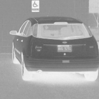
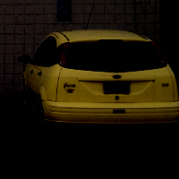
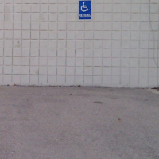
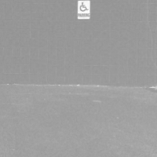

Detecting a car in a parking lot
===================================
In this example we are going to determine if a particular car is parked
in a certain parking spot.  In this scenario a yellow car keeps parking
in the handicapped parking spot even though we aren't authorized to.

Of course the person doing this is breaking the law, and hasn't been caught
by the parking attendant.  In this case we will use a vision system to monitor
the parking spot.

Here is what the image looks like without the car in the spot:

.. figure:: ../static/images/parking-no-car.png
   :scale: 100 %
   :align: center
   :alt: Photo of parking lot

Here is what the image looks like with the car in spot:

.. figure:: ../static/images/parking-car.png
   :scale: 100 %
   :align: center
   :alt: Photo of car in parking lot

So a simple test of looking at the two is to look for yellow?  We could just
search the whole picture for the color yellow, but if the car is parked in
the spot to the left then they aren't violating the law.  So we only want to check
the image in that particular area. So we are going to crop out that area
and do our image processing for yellow just in that section.

First thing to do is load up the images:

	>>> car_in_lot = Image("parking-car.png")
	>>> car_not_in_lot = Image("parking-no-car.png")

:download:`Download the car image <../static/images/parking-car.png>`

:download:`Download the no car image <../static/images/parking-no-car.png>`

We will use the car in the lot picture to determine the area we want to
inspect.  The image is 800 by 600 pixels.  And the location of the box we
want around the car, sometimes refered to as a region of interest (ROI), starts
at the coordinates 470, 200, and is about 200 by 200 pixels in size.

	>>> car = car_in_lot.crop(470,200,200,200)
	>>> car.show()

You should get something simliar to the following image:

.. figure:: ../static/images/parking-car-only.png
   :scale: 100 %
   :align: center
   :alt: Photo of car

But really that's just about where the car is at, not necessarily just the
car.  Well, what we can do now is try to just extract the yellow color.

	>>> yellow_car = car.colorDistance(Color.YELLOW)
	>>> yellow_car.show()

	 

As you can see what this did is converted the color image to grey and
made the yellow color really stand out as black.  Now it is starting to
get easier for us to extract that color.  In fact, now that we have that
image all we want to do is subtract that image from the car image.

	>>> only_car = car - yellow_car
	>>> only_car.show()

and you should now have something that looks like:

Now that we have the **object** extract from color we have to have some way
to measure it.  This is very simple with a function called **meanColor()**.

	>>> only_car.meanColor()
	>>> (25.604575, 18.880775, 4.4940750000000005)

Now that we have those values, let's do the same for the parking lot without
any cars.  Then we will look at the differences in their mean colors as a
way to determine if the car is parked in the lot or not.

	>>> car_not_in_lot = Image("parking-no-car.png")
	>>> no_car = car_not_in_lot.crop(470,200,200,200)

Which will give an image similiar to:

Then we try to do the color extraction:

	>>> yellow_car = no_car.colorDistance(Color.YELLOW)
	>>> yellow_car.show()

and should get an image similiar to:

Then we try and subtract the color again and get the **meanColor()**:

	>>> only_car = car - yellow_car
	>>> only_car.meanColor()
	>>> (5.031350000000001, 3.6336250000000003, 4.683625)

As you can see the mean color differences, when a car is there it is::

	(25.604575, 18.880775, 4.4940750000000005)

When a car isn't there it is::

	(5.031350000000001, 3.6336250000000003, 4.683625)

We can then use those values to determine if the car is actually there or not.
Those are the RGB values.  So our threshold could be::

	If R > 15 and B > 10:
		Car is in the lot!

This is generally pseudo code, but we could have it send an e-mail, etc.
