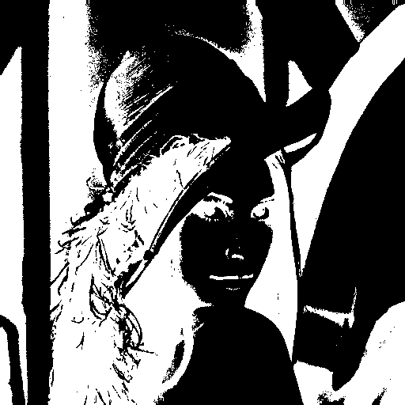
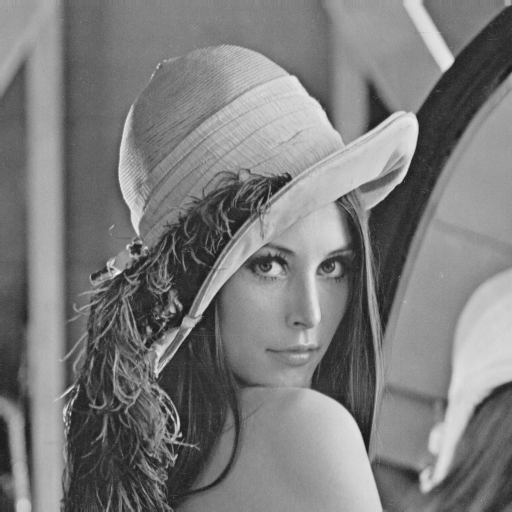
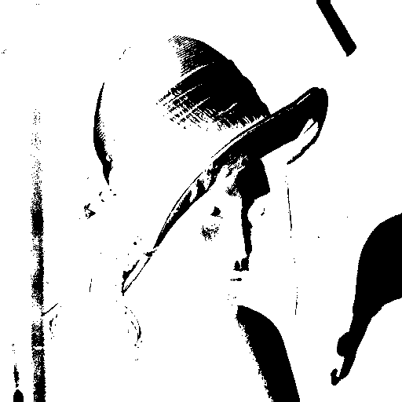
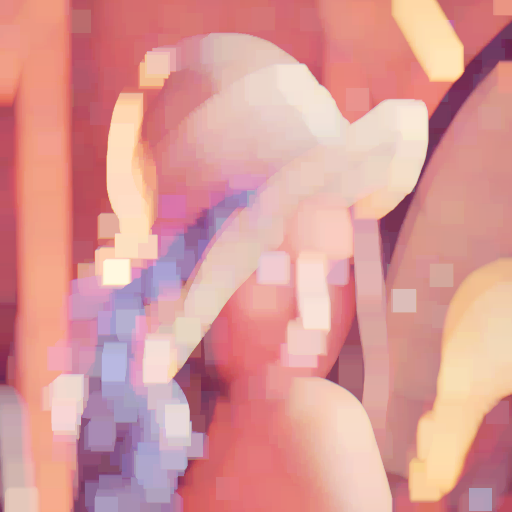
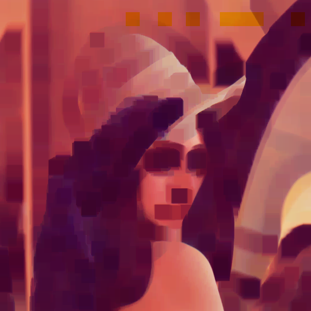
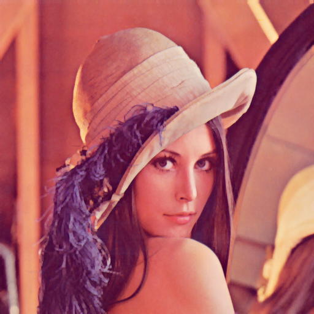
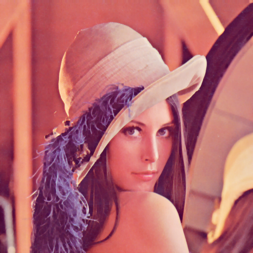

Segmenting the Image and Morphology
======================================
Typically in computer vision you need to be able to extract or define
something from the rest of the picture.  For example detection a person
from a background. This is typically called segmentation.  You are basically
breaking the image up into chunks or segments in which you can do more processing
on.

Let's start with an example, we will use a picture of a face:

.. figure:: ../images/lenna.png
   :scale: 100 %
   :align: center
   :alt: lenna

Let's say we want to just do some vision processing on her face.  In this
case we want to **crop** out that section of the image.

	>>> lenna = Image("lenna")
	>>> face = lenna.crop(200,200,200,200)
	>>> face.show()

and you should see something like:

.. figure:: ../images/lenna-cropped.png
   :scale: 100 %
   :align: center
   :alt: lenna cropped

While this method of extracting the face is ok if you know the 
coordinates of the face, with SimpleCV you have the possibility 
to automate the task of finding segments in a picture. In this 
case we want to find a face:

	>>> segment = HaarCascade("face.xml")
	>>> autoface = lenna.findHaarFeatures(segment)
	>>> if ( autoface is not None ):
	>>>	face = autoface[-1].crop()

Now with this we can do some interesting things.  For instance maybe
we want to zoom into the face to see better detail on it. This makes it
three times the size of the original:

	>>> bigface = face.scale(3)
	>>> bigface.show()

Or maybe you want to rotate the image 90 degrees:

	>>> rotated = lenna.rotate(90)
	>>> rotated.show()

Something else that is commonly used is called a warp, or shear.  You can
think of this as looking at an image from a perspective.

	>>> warped = lenna.warp(((100,10),(300,10), (450,300), (10,300)))
	>>> warped.show()

And should get an image similar to:

.. figure:: ../images/lenna-warped.png
   :scale: 100 %
   :align: center
   :alt: lenna cropped

Or if we want the negative of the image, we just invert it:

	>>> inverted = lenna.invert()
	>>> inverted.show()

	
The image should be similiar to:

.. figure:: ../images/lenna-inverted.png
   :scale: 100 %
   :align: center
   :alt: lenna inverted

Binary images are just that.  As mentioned greyscale images have a single
channel, and color images have three channels (RGB). Each channel ranges
from 0 to 255.  What we do when we create a binary images is either push
those values one way or the other.  You can think of the images as something
like the famous ink blot test.  For instance looking at the face in this way.

To explain a little more in detail, a binarize takes a greyscale image, and
pushes the color one way or another.  Let's first get our greyscale image.

	>>> grey = lenna.getGreyscale()
	>>> grey.show()

and you should have something like:

That is the single channel image between 0-255. In fact, that's all an image
really is, just a matrix of pixels between 0 and 255.  To see what we are
talking about, let's actually grab that matrix.

	>>> matrix = grey.getNumpy()
	>>> print matrix

and you should have output similiar to::

	array([[[162, 162, 162],
					[162, 162, 162],
					[162, 162, 162],
					...
					[ 98,  98,  98],
					[108, 108, 108],
					[108, 108, 108]]], dtype=uint8)

As you can see those are the pixel values.  And if we want to access the
pixel at the X,Y coordinate of 0,0, then now we can just do:

	>>> print matrix[0][0]
	>>> array([162, 162, 162], dtype=uint8)

So you can see it has the pixel value of 162.  This matters in the case
of using a binarize as mentioned before it can be used to push the value
up or down based on a given threshold.  The threshold we will use in this
case is 127 as that is value for binarize.  What happens in this
case is that the code runs through the matrix and says if the value is
greater than the threshold, then make it black (0) otherwise make it
white (255).  In our instance we have 162 > 127 so that pixel will go to
black, and if the pixel value was say 90 then it would go to white.

If you view the image you will see that the pixels in those coordinates
are black.  But let's actually show that is what is going on behind the
scenes.  So we will print the grey matrix, then binarize, then print the
matrix again and you will see the values have changed.::

	>>> matrix = lenna.getNumpy()
	>>> print matrix
	array([[[226, 137, 125],
					[226, 137, 125],
					[226, 137, 125],
					..., 
					[177,  62,  79],
					[185,  74,  81],
					[185,  74,  81]]], dtype=uint8)
	>>> binarize = lenna.binarize()
	>>> binarize_matrix = binarize.getNumpy()
	>>> print binarize_matrix
	array([[[  0,   0,   0],
        [  0,   0,   0],
        [  0,   0,   0],
        ..., 
        ..., 
        [255, 255, 255],
        [255, 255, 255],
        [255, 255, 255]]], dtype=uint8)
	
	

As you can see the values have changed to 0 and if you compare the original
lenna image to the binarized version you will see this is also true.

As mentioned in the previous section, we were using a threshold of 127.
But where did we set it?  Well actually we didn't and this was intentional.
The reason being that we wanted to talk a little bit about dynamic vs. fixed
thresholds.  In our example above we are using a dynamic threshold, where
as using the number 127 is a fixed threshold.  The fixed is just that, fixed
at the value.  This maybe good if you are trying to use computer vision
where you need segmentation and the image doesn't change much.  Then you
can really tweak the threshold value to really bring out parts of the image
you are looking for.

Now dynamic thresholding is a bit more complex, but it is also adaptive,
so if the scene changes then you don't adjust your image may just appear
completely white or black.  Typically dynamic thresholding is used and
then fine tuned with fixed.  To use them it's just:

	>>> lenna.binarize() #dynamic
	>>> lenna.binarize(127) #fixed

	
	Fixed Thresholding

	
	Dynamic Thresholding

Another useful function is dilate.  This would be used to basically make
things grow.

	>>> dilated = lenna.dilate(10)
	>>> dilated.show()

Erode is basically the opposite of dilate.  You can think of it just like
soil erosion on the ocean, that it basically wears away at the image

	>>> eroded = lenna.erode(10)
	>>> eroded.show()

There is also morphOpen, which operates similiar to dilate, except it
takes surrounding pixels into account.  As you can this is much more subtle
and seems to be more of blending effect.

	Morph Open
	

	
	Morph Close

.. figure:: ../images/lenna.png
	:scale: 100 %
	:align: center
	
	Original Image (for reference)

To do these operations it's just:

	>>> open = lenna.morphOpen()
	>>> open.show()
	>>> closed = lenna.morphClose()
	>>> closed.show()

